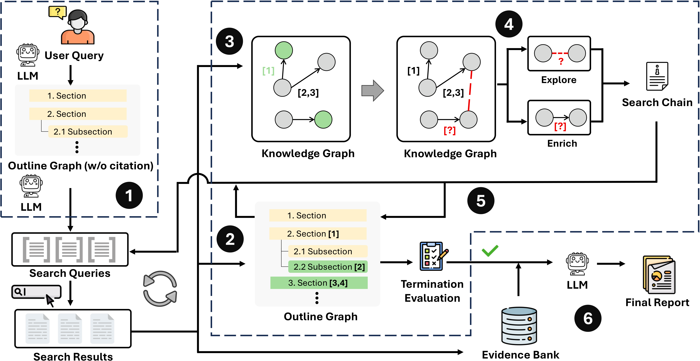

# A Tale of Two Graphs: 分离知识探索与大纲结构的开放式深度研究

**[English README](README.md)**

[](https://microsoft.github.io/DKI_LLM/dualgraph/dualgraph_index.html)
[](https://arxiv.org/abs/2602.13830)

我们提出了 **DualGraph Memory**，一种通过两个协同演化的图结构将智能体的知识与写作分离的架构：**大纲图（Outline Graph, OG）** 负责管理报告结构，**知识图谱（Knowledge Graph, KG）** 存储细粒度的知识单元。通过分析 KG 拓扑结构与 OG 结构信号，DualGraph 生成有针对性的搜索查询，实现更高效、更全面的迭代知识驱动探索。DualGraph 在三个基准测试中持续超越最先进的基线方法，在 DeepResearch Bench 上使用 GPT-5 达到了 **53.08 的 RACE 分数**。

<div align="center">
  
</div>

## 快速上手

### 步骤 1：安装依赖

```bash
pip install -r requirements.txt

# 或使用 uv（推荐，速度更快）
uv pip install -r requirements.txt
```

### 步骤 2：配置环境变量

```bash
cd deepresearch/baselines
cp .env.template .env
# 编辑 .env 填入你的凭据
```

**LLM 配置（必需）：**

| 变量 | 说明 | 示例 |
|---|---|---|
| `LLM_PROVIDER` | `azure_openai` 或 `openai` | `azure_openai` |
| `LLM_MODEL_NAME` | 模型部署名称 | `gpt-4.1-20250414` |
| `LLM_API_KEY` | API 密钥（Azure AAD 认证时不需要） | |
| `LLM_BASE_URL` | API 基础 URL | `https://api.openai.com/v1` |

**搜索配置（至少配置一个）：**

| 变量 | 说明 |
|---|---|
| `BING_APP_ID` | Bing Search API 密钥（用于 `--search-provider bing`） |
| `BING_ENDPOINT` | Bing Search 端点 URL |
| `SERPER_KEY_ID` | Serper API 密钥（用于 `--search-provider serper`） |

**网页读取（至少配置一个）：**

| 变量 | 说明 |
|---|---|
| `READPAGE_METHOD` | `crawl4ai`、`jina` 或 `firecrawl` |
| `FIRECRAWL_API_URL` | Firecrawl API URL |
| `JINA_API_KEYS` | Jina API 密钥 |
| `JINA_FALLBACK` | 设为 `true` 使用 Jina 作为备用读取器 |

### 步骤 3：命令行运行

```bash
cd deepresearch/baselines

# 使用示例数据集运行（默认）
python main.py

# 指定模型和数据集
python main.py \
    --models gpt-4.1-20250414 \
    --datasets example \
    --id-range 1 1

# 使用自定义数据集，批量运行
python main.py \
    --models gpt-4.1-20250414 \
    --datasets my_dataset \
    --id-range 1 20 \
    --search-provider serper
```

### 步骤 4：可视化 Web UI（Chainlit）

DualGraph 提供了基于 [Chainlit](https://github.com/Chainlit/chainlit) 的交互式 Web 界面，可以更直观地使用。

```bash
cd deepresearch/baselines
chainlit run app.py -w
```

然后在浏览器中打开 <http://localhost:8000>。

**Web UI 功能：**

- 输入任意研究问题，即可启动实时研究会话
- 输入 **`demo`** 可回放预生成的示例报告（无需 LLM 调用）
- 实时显示流水线各阶段的进度更新
- 在设置面板中调整参数（搜索引擎、查询数量、聚类设置等）

### 步骤 5：评测

项目中包含了一个 `example/` 示例数据集供快速测试。论文中使用的基准数据集请参见 [eval_dataset/README.md](eval_dataset/README.md) 获取下载方式。

添加自定义数据集：在 `eval_dataset/<你的数据集名>/` 下放置 `query.jsonl` 文件：

```json
{"id": 1, "prompt": "你的研究问题"}
```

## 命令行参数

| 参数 | 默认值 | 说明 |
|---|---|---|
| `--models` | `gpt-4.1-20250414-2` | 模型部署名称 |
| `--version` | `v1` | 输出目录的版本标识 |
| `--datasets` | `example` | 数据集名称（`eval_dataset/` 下的子文件夹） |
| `--search-provider` | `bing` | 搜索后端：`bing` 或 `serper` |
| `--kg-query-num` | `10` | 每轮从知识图谱生成的搜索查询数 |
| `--og-query-num` | `10` | 每轮从大纲生成的搜索查询数 |
| `--id-range` | `1 1` | 查询 ID 范围 [起始, 结束]（含两端） |
| `--max-iter` | `5` | 每个查询的最大研究迭代次数 |
| `--max-concurrency` | `5` | 批量处理的最大并发线程数 |
| `--language` | `English` | 报告语言：`English` 或 `Chinese` |
| `--disable-early-stopping` | `False` | 禁用多维度早停机制 |

## 引用
如果您觉得本仓库有用，欢迎 star 或引用：
```
@article{shi2026dualgraph,
  title={A Tale of Two Graphs: Separating Knowledge Exploration from Outline Structure for Open-Ended Deep Research},
  author={Shi, Zhuofan and Ma, Ming and Yao, Zekun and Yang, Fangkai and Zhang, Jue and Han, Dongge and R{\"u}hle, Victor and Lin, Qingwei and Rajmohan, Saravan and Zhang, Dongmei},
  journal={arXiv preprint arXiv:2602.13830},
  year={2026}
}
```

## 贡献指南

本项目欢迎贡献和建议。大多数贡献需要您同意贡献者许可协议 (CLA)，声明您有权并确实授予我们使用您贡献的权利。详情请访问 https://cla.opensource.microsoft.com。

当您提交 Pull Request 时，CLA 机器人会自动判断您是否需要提供 CLA，并相应地标注 PR（例如状态检查、评论）。请按照机器人提供的说明操作。在所有使用我们 CLA 的仓库中，您只需执行一次。

本项目采用了 [Microsoft 开源行为准则](https://opensource.microsoft.com/codeofconduct/)。
更多信息请参阅[行为准则常见问题](https://opensource.microsoft.com/codeofconduct/faq/)，或联系 [opencode@microsoft.com](mailto:opencode@microsoft.com)。

## 商标

本项目可能包含项目、产品或服务的商标或标识。Microsoft 商标或标识的授权使用须遵守
[Microsoft 商标和品牌指南](https://www.microsoft.com/en-us/legal/intellectualproperty/trademarks/usage/general)。
在本项目的修改版本中使用 Microsoft 商标或标识不得造成混淆或暗示 Microsoft 赞助。
任何第三方商标或标识的使用均须遵守相应第三方的政策。

## 问题

如有任何问题或发现 bug，请[提交 issue](https://github.com/microsoft/DKI_LLM/issues)。Issue 也可以作为讨论区使用。

如需联系作者，请发送邮件至：`fangkaiyang AT microsoft.com`。
