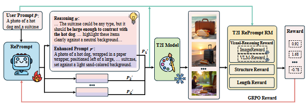

# R1-Prompter

[//]: # ([![Project]&#40;http://img.shields.io/badge/Project-SER-E3E4C8.svg&#41;]&#40;https://microsoft.github.io/DKI_LLM/ser/ser_index.html&#41;)

[//]: # ([![Paper]&#40;http://img.shields.io/badge/Paper-arxiv.2411.00418-99D4C8.svg&#41;]&#40;https://arxiv.org/abs/2411.00418&#41;)

In this paper, we propose R1-Prompter, a self-reflective reprompting model designed to improve prompt quality for T2I synthesis. Our method fine-tunes an LLM using a GRPO-based reinforcement learning framework, encouraging it to generate chain-of-thought enriched prompts that better guide image generation. A reward model evaluates the resulting image for realism, semantic alignment, and compositional quality, providing feedback to refine the reprompting process. Extensive experiments on GenEval and T2I-Compbench show that R1-Prompter significantly enhances image fidelity and alignment in both simple and compositional scenarios, achieving state-of-the-art performance across multiple T2I backbones.

[//]: # (<div align="center">)

[//]: # (  )

[//]: # (</div>)

## Quick Start 🚀

### Step 1: Build Environment
```bash
conda env create -f environment.yaml
conda activate r1-prompter

```

### Step 2: Prepare Data

[//]: # (- Download raw data from [Ultrafeedback]&#40;https://huggingface.co/datasets/HuggingFaceH4/ultrafeedback_binarized&#41;, [Summarize]&#40;https://huggingface.co/datasets/HuggingFaceH4/summarize-from-feedback&#41;, [HH-RLHF]&#40;https://huggingface.co/datasets/Anthropic/hh-rlhf&#41;, [Stackoverflow]&#40;https://huggingface.co/datasets/HuggingFaceH4/stack-exchange-preferences&#41;.)

[//]: # (- Download base model from [LLama3-8B]&#40;https://huggingface.co/meta-llama/Meta-Llama-3-8B&#41;,[Mistral-7B]&#40;https://huggingface.co/mistralai/Mistral-7B-v0.1&#41;, [LLama2-13B]&#40;https://huggingface.co/meta-llama/Llama-2-13b&#41;, [LLama2-70B]&#40;https://huggingface.co/meta-llama/Llama-2-70b&#41;)

### Step 3: Train

[//]: # (Our reward model is initialized from the SFT model. We initialize the base model and execute the following script:)

We use the following script to train our model:

```shell
CUDA_VISIBLE_DEVICES=0,1,2,3,4,5,6,7 accelerate launch --config_file=deepspeed_2.yaml r1_prompter.py \
  --data data/generation_prompts_1k_filterd.txt \
  --gpt_path Qwen/Qwen2.5-3B-Instruct \
  --sdmodel_name black-forest-labs/FLUX.1-dev \
  --outdir r1_prompter_with_flux
```


## Citation
If you find this repository useful, please considering giving ⭐ or citing:


## Contributing

This project welcomes contributions and suggestions.  Most contributions require you to agree to a
Contributor License Agreement (CLA) declaring that you have the right to, and actually do, grant us
the rights to use your contribution. For details, visit https://cla.opensource.microsoft.com.

When you submit a pull request, a CLA bot will automatically determine whether you need to provide
a CLA and decorate the PR appropriately (e.g., status check, comment). Simply follow the instructions
provided by the bot. You will only need to do this once across all repos using our CLA.

This project has adopted the [Microsoft Open Source Code of Conduct](https://opensource.microsoft.com/codeofconduct/).
For more information see the [Code of Conduct FAQ](https://opensource.microsoft.com/codeofconduct/faq/) or
contact [opencode@microsoft.com](mailto:opencode@microsoft.com) with any additional questions or comments.

## Trademarks

This project may contain trademarks or logos for projects, products, or services. Authorized use of Microsoft 
trademarks or logos is subject to and must follow 
[Microsoft's Trademark & Brand Guidelines](https://www.microsoft.com/en-us/legal/intellectualproperty/trademarks/usage/general).
Use of Microsoft trademarks or logos in modified versions of this project must not cause confusion or imply Microsoft sponsorship.
Any use of third-party trademarks or logos are subject to those third-party's policies.

## Question

If you have any question or find any bug, please go ahead and [open an issue](https://github.com/microsoft/DKI_LLM/issues). Issues are an acceptable discussion forum as well.

If you want to concat the author, please email: `mingrui0001@gmail.com`.